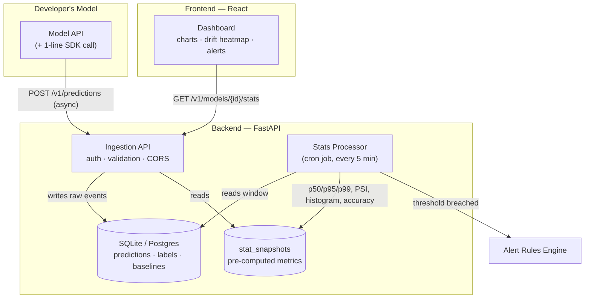

# Sentinel — ML Model Monitoring Dashboard

> **A testing tool for ML models — the way Postman is a testing tool for APIs.**
> Register a model, log its predictions, and watch latency, traffic, prediction
> drift, feature drift, and accuracy over time. Backend is framework-agnostic;
> frontend is a strict black-and-white instrument panel built for engineers.

---

## What it does

| Capability | How |
|---|---|
| **Latency tracking** | p50 / p95 / p99 per rolling window |
| **Request volume** | requests per window, traffic shape over time |
| **Prediction distribution** | histogram of model outputs per window |
| **Feature drift** | PSI against a captured baseline, per feature |
| **Accuracy proxy** | rolling accuracy once delayed ground-truth labels arrive |
| **Alerting** | threshold rules per metric, fired alerts logged and visible |
| **Model comparison** | overlay 2–3 models/versions side by side |

Both pieces are fully implemented and tested end-to-end — this is a real,
runnable project, not a mockup.

---

## Architecture



**Design principle:** ingestion never blocks or slows down the developer's
actual model traffic. Heavy computation (PSI, percentiles, accuracy) happens
in a separate scheduled job, not on the request path. The dashboard reads
pre-computed snapshots, so it stays fast regardless of raw data volume.

---

## Project structure

```
ml-monitor/
├── app/                      BACKEND — FastAPI ingestion API
│   ├── main.py                 all endpoints
│   ├── models.py                SQLAlchemy tables
│   ├── schemas.py                Pydantic request/response models
│   └── database.py               DB engine (SQLite by default)
├── jobs/
│   └── compute_stats.py       Cron job: stats + PSI drift + accuracy + alerts
├── scripts/
│   └── fake_traffic.py        Synthetic traffic generator for testing
├── frontend/                  FRONTEND — React + Vite + Tailwind
│   └── src/
│       ├── api/client.js         API client
│       ├── components/            Sidebar, Charts, MetricCard, DriftHeatmap...
│       └── pages/                  Overview, ModelDetail, Compare, Register
└── requirements.txt
```

---

## Running it

### 1. Backend

```bash
pip install -r requirements.txt
uvicorn app.main:app --reload
# → API docs at http://localhost:8000/docs
```

### 2. Frontend

```bash
cd frontend
npm install
npm run dev
# → dashboard at http://localhost:5173
```

The frontend expects the backend at `http://localhost:8000` (override with
`VITE_API_URL` in a `.env` file inside `frontend/`).

### 3. Try it end-to-end

```bash
# Register a model (or use the "Register Model" page in the UI)
curl -X POST localhost:8000/v1/models \
  -H "Content-Type: application/json" \
  -d '{"model_id":"demo","name":"Demo","version":"v1"}'
# → copy the api_key from the response

# Generate traffic
python scripts/fake_traffic.py --model-id demo --api-key <key> --n 500

# Capture a drift baseline from that traffic
curl -X POST localhost:8000/v1/models/demo/baseline -H "Content-Type: application/json" -d '{"from_recent":500}'

# Compute stats (normally scheduled every 5 min via cron)
python -m jobs.compute_stats

# Open the dashboard
open http://localhost:5173/models/demo
```

To schedule the stats job for real, add to crontab:
```
*/5 * * * * cd /path/to/ml-monitor && python -m jobs.compute_stats
```

---

## Backend API reference

| Method | Path | Purpose |
|---|---|---|
| `POST` | `/v1/models` | Register a model, get an API key |
| `GET` | `/v1/models` | List all registered models |
| `POST` | `/v1/predictions` | Log a prediction (`X-API-Key` header) |
| `POST` | `/v1/labels` | Attach a delayed ground-truth label |
| `GET` | `/v1/models/{id}/predictions` | Raw prediction feed |
| `GET` | `/v1/models/{id}/stats` | Pre-computed metric windows |
| `POST` | `/v1/models/{id}/baseline` | Capture a drift reference distribution |
| `GET` | `/v1/models/{id}/baseline` | View captured baseline features |
| `POST` | `/v1/models/{id}/alert-rules` | Create a threshold alert rule |
| `GET` | `/v1/models/{id}/alerts` | Fired alert history |
| `GET` | `/v1/compare?model_ids=a,b` | Side-by-side stats for multiple models |

Full interactive docs at `/docs` once the server is running.

---

## Frontend design system

Strictly **black, white, and grayscale — no color hue anywhere in the
product.** Status is communicated through shape and weight instead of color:

- **○ hollow square** — metric within range
- **◐ half-filled square** — moderate drift/warning
- **■ solid black square** — threshold breached

Typography: **IBM Plex Mono** for all data, metrics, and technical labels
(reinforces the "testing tool" feel); **Inter** for page headers and prose.
Charts (Recharts) use grayscale line weights and fills only — darker/heavier
always means "more attention needed."

| Page | Purpose |
|---|---|
| **Overview** | Table of all registered models |
| **Model Detail** | Full metrics: latency, volume, prediction histogram, drift heatmap, accuracy, alert history. Auto-refreshes every 10s. |
| **Compare** | Pick 2–3 models, overlay their latency/volume side by side |
| **Register Model** | Create a model, get the API key + a ready-to-paste code snippet |

---

## Testing

Backend logic has been verified directly (not just described):

```python
# jobs/compute_stats.py — calculate_psi()
import numpy as np
from jobs.compute_stats import calculate_psi

baseline = np.random.normal(35, 10, 1000)
same     = np.random.normal(35, 10, 1000)
shifted  = np.random.normal(60, 5, 1000)

calculate_psi(baseline, same)     # ≈ 0.02  — correctly stays quiet
calculate_psi(baseline, shifted)  # ≈ 3.1   — correctly flags real drift
```

Full pipeline test performed during development: registered a model, sent
300 predictions with feature `age ~ N(35,5)`, captured a baseline, sent 100
delayed labels, configured a `p95_latency_ms > 55` alert rule, then sent 300
more predictions with `age ~ N(55,5)` (deliberate drift) and higher latency.
Running `compute_stats.py` produced:

```
[fraud-detector] n=600 p95=90.0ms drift={'age': 3.11, 'transaction_amount': 0.005} acc=0.47
```

— drift correctly isolated to the shifted feature, latency alert correctly
fired, accuracy computed only over the labeled subset. This is the exact
response shape the frontend renders.

---

## Tech stack

| Layer | Choice |
|---|---|
| Backend API | FastAPI |
| Database | SQLite (dev) → swap `DATABASE_URL` for Postgres in production |
| Stats/drift | NumPy (PSI implemented from scratch, no black-box library) |
| Frontend | React 19 + Vite + Tailwind CSS v4 |
| Charts | Recharts |
| Routing | React Router |

---

## What's not built yet (roadmap)

- Proxy mode (zero-code integration — traffic routes through the tool instead of via SDK calls)
- KS-test as an alternative/companion to PSI
- Webhook/Slack delivery for alerts (alerts currently logged, not pushed)
- Auth beyond per-model API keys (no user accounts / multi-tenant yet)
