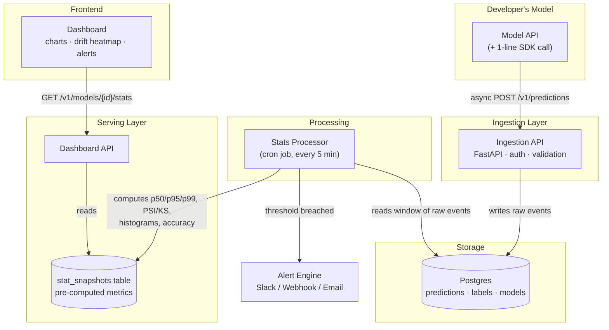
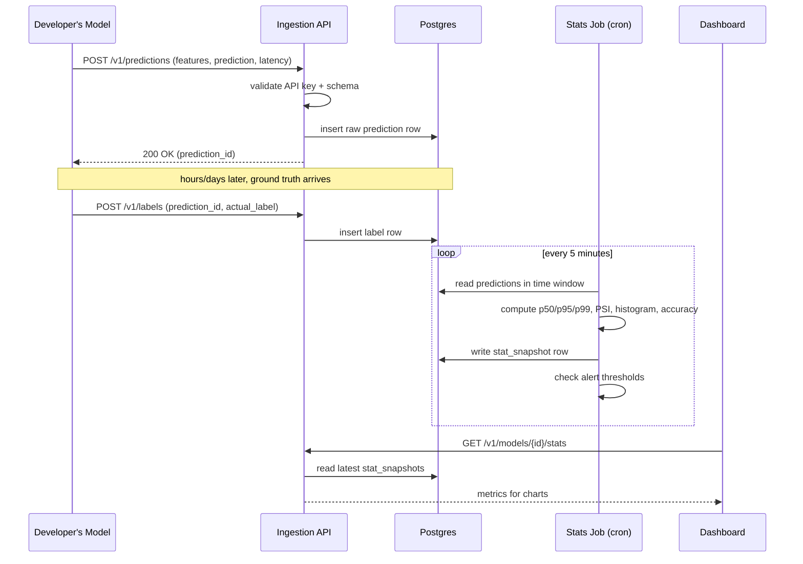

# 📊 ML Model Monitoring Dashboard

> **Postman for ML models.** Developers point their model's predictions at this
> tool, and it tracks latency, traffic, prediction drift, feature drift, and
> accuracy over time — with alerts and version comparisons.

---

## 1. What this project does

A model works fine in the notebook. Six weeks after deployment, nobody knows if:

- it's gotten **slower**
- traffic has **spiked or died**
- the **input data has shifted** from what it was trained on (drift)
- the **predictions look different** than they used to
- **accuracy has silently degraded** once real-world labels come in

This tool answers those questions automatically, for any model, regardless of
framework — because it doesn't touch the model itself. It just watches the
traffic going in and out.

| Capability | Description |
|---|---|
| **Latency tracking** | p50 / p95 / p99 response time per model |
| **Request volume** | requests/sec, traffic spikes and drops |
| **Prediction distribution** | is the model's output shape changing over time? |
| **Feature drift** | PSI / KS-test comparing live input data vs. a training baseline |
| **Accuracy proxy** | rolling accuracy once real-world labels arrive (delayed feedback loop) |
| **Alerting** | Slack/webhook/email when any metric crosses a threshold |
| **Model comparison** | overlay model v1 vs v2, like diffing two Postman collections |

---

## 2. How a developer uses it

```
Developer's Model                     This Tool
┌──────────────────┐   log calls    ┌───────────────────────┐
│  /predict         │ ─────────────▶ │  Ingestion API          │
│  (their own API)  │  (async, SDK) │  (this project)         │
└──────────────────┘                └───────────────────────┘
```

1. Register a model → get an API key (like creating a Postman collection).
2. Add **one line** to their serving code to log each prediction.
3. Watch the dashboard. No change to their model, no added latency on the
   real request path (logging is fire-and-forget).

```python
# in the developer's own model-serving code
requests.post(
    "https://your-tool.com/v1/predictions",
    headers={"X-API-Key": API_KEY},
    json={
        "model_id": "fraud-detector-v1",
        "input_features": {"age": 34, "income": 52000},
        "prediction": 0.83,
        "latency_ms": 42.1,
    },
)
```

---

## 3. Architecture



**Why this shape, in plain terms:**

- The **Ingestion API** does the absolute minimum on the request path (auth +
  write to DB) so logging never slows down the developer's actual model.
- The **Stats Processor** runs separately, on a schedule, so heavy math (PSI,
  percentiles) never blocks ingestion.
- The dashboard reads from a **pre-computed table** (`stat_snapshots`), not
  raw data — so charts load instantly even with millions of logged predictions.

---

## 4. Data flow for one prediction



---

## 5. MVP build order

Build in this order — each step is independently useful and testable before
moving to the next.

| # | Feature | Status |
|---|---|---|
| 1 | **Ingestion API + Postgres** (raw storage only) | ✅ included in this repo |
| 2 | **Cron job**: latency / volume / prediction-distribution stats | ✅ included in this repo |
| 3 | **Basic dashboard** (charts only, no alerts) | 🔲 frontend, not yet built |
| 4 | **PSI / KS-test drift + baseline capture** | ✅ function included, not yet wired to a baseline |
| 5 | **Labels + accuracy proxy** | ✅ ingestion included, accuracy calc not yet in cron job |
| 6 | **Alerting** (Slack/webhook/email) | 🔲 |
| 7 | **Model comparison view** | 🔲 |
| 8 | **Proxy mode** (zero-code integration) | 🔲 nice-to-have, last |

---

## 6. Project structure

```
ml-monitor/
├── app/
│   ├── main.py          # FastAPI app — all API endpoints (Step 1)
│   ├── models.py         # SQLAlchemy tables
│   ├── schemas.py        # Pydantic request/response models
│   └── database.py       # DB engine/session (SQLite by default, swap for Postgres)
├── jobs/
│   └── compute_stats.py  # Cron job: rolling stats + PSI (Steps 2 & 4)
├── scripts/
│   └── fake_traffic.py   # Synthetic traffic generator for testing
└── requirements.txt
```

---

## 7. Running it

```bash
# 1. Install dependencies
pip install -r requirements.txt

# 2. Start the ingestion API
uvicorn app.main:app --reload
# → docs at http://localhost:8000/docs

# 3. Register a model
curl -X POST localhost:8000/v1/models \
  -H "Content-Type: application/json" \
  -d '{"model_id":"demo-model","name":"Demo","version":"v1"}'
# → copy the api_key from the response

# 4. Generate fake traffic to test with
python scripts/fake_traffic.py --model-id demo-model --api-key <key> --n 500

# 5. Run the stats job (normally scheduled via cron every 5 min)
python -m jobs.compute_stats

# 6. Check computed stats
curl localhost:8000/v1/models/demo-model/stats
```

All endpoints are also self-documented at `/docs` (Swagger UI) once the
server is running.

---

## 8. Testing strategy

| What | How |
|---|---|
| Ingestion correctness | `scripts/fake_traffic.py` sends known volumes/latencies; assert stats match |
| Drift detection | Feed two identical distributions → PSI ≈ 0. Feed a shifted distribution → PSI > 0.2 |
| Load | Run `fake_traffic.py` at high volume or use `locust` to find breaking points |
| Accuracy proxy | Send predictions, then send delayed labels for a subset, confirm accuracy only computes over labeled data |

Example drift test (already verified working in this repo):

```python
import numpy as np
from jobs.compute_stats import calculate_psi

baseline = np.random.normal(35, 10, 1000)
same     = np.random.normal(35, 10, 1000)
shifted  = np.random.normal(50, 10, 1000)

assert calculate_psi(baseline, same) < 0.1      # no false alarm
assert calculate_psi(baseline, shifted) > 0.2    # catches real drift
```

---

## 9. Tech stack

| Layer | MVP choice | Scale-up option |
|---|---|---|
| Ingestion | FastAPI | same, horizontally scaled |
| Database | SQLite (dev) | Postgres / TimescaleDB |
| Stats processing | Python cron job | Kafka + Flink/Spark stream |
| Raw log archive | — | S3 + Parquet |
| Frontend | — (Step 3, not yet built) | React + Recharts |
| Alerting | — (Step 6) | rule engine → Slack/webhook |

---

## 10. Design principle behind every decision here

**Never slow down or risk the developer's actual model traffic.** Ingestion
is fire-and-forget, computation is decoupled into a background job, and the
dashboard never queries raw data directly. If this tool goes down, the
developer's model keeps serving traffic — it just stops being monitored
until this tool comes back.
